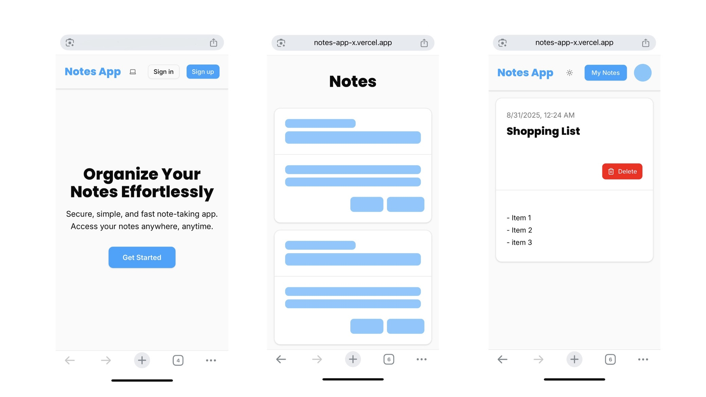
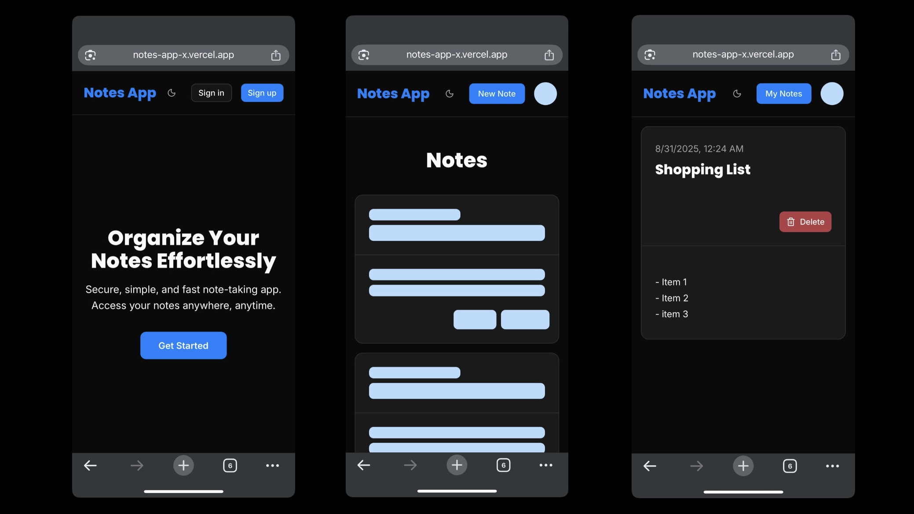

# Notes App

Notes App is a simple note-taking app and a practice full stack project built with React and Supabase.

---

## Demo

[Live Demo](https://notes-app-x.vercel.app)

---

## Screenshots





---

## Features

- User authentication (sign up, sign in) with Supabase Auth
- Create, read, update, and delete notes
- PostgreSQL database (via Supabase) with Row Level Security (RLS)
- Responsive UI with light, dark, and system themes
- Modern design using TailwindCSS and shadcn/ui
- Protected routes and session management

---

## Tech Stack

- [React](https://react.dev/)
- [Vite](https://vitejs.dev/)
- [TypeScript](https://www.typescriptlang.org/)
- [React Router](https://reactrouter.com/)
- [Supabase](https://supabase.com/)
- [TailwindCSS](https://tailwindcss.com/)
- [shadcn/ui](https://ui.shadcn.com/)

---

## Project Structure

```
src/
  components/      # UI and feature components
  context/         # Auth and theme providers
  data/            # Data helpers (notes, users)
  lib/             # Supabase client, types, utils
  pages/           # All app pages (home, login, notes, etc.)
  main.tsx         # App entry
  App.tsx          # App shell and routing
```

---

## Getting Started

1. **Clone the repository:**

```sh
git clone https://github.com/xncee/notes-app-supabase.git
cd notes-app-supabase
```

2. **Install dependencies:**

```sh
npm install
```

3. **Set up environment variables:**

- Copy `.env.example` to `.env` and add your Supabase project credentials.

4. **Run the development server:**

```sh
npm run dev
```

5. **Open the app:**

- Visit [http://localhost:5173](http://localhost:5173) in your browser.
